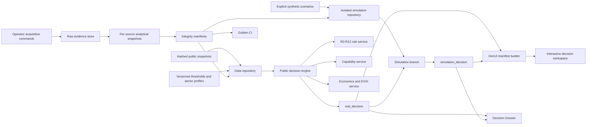
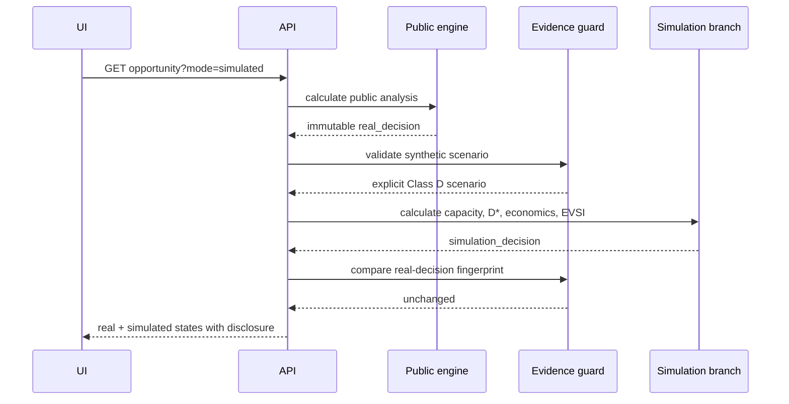

# 03 — System Architecture

<!-- core_version: 2.0.0; supersedes: 1.0.0; effective_date: 2026-09-02 -->

## 1. Architectural objective

The architecture must demonstrate the complete reasoning chain without requiring live Ministry connectivity:

```text
Frozen public evidence
→ harmonised opportunity record
→ deterministic R-rule ledger
→ specification and evidence controls
→ capability test
→ economics / intervention / EVSI
→ decision state and route
→ adaptive decision surface
→ Decision Dossier
```

A separate synthetic branch demonstrates the effect of Ministry-grade data without contaminating the public result.

## 2. Design principles

1. **Evidence before interface.** UI components render structured decisions; they do not infer them.
2. **Deterministic calculations.** Arithmetic, thresholds, state transitions and route gates are code, not free-form model output.
3. **Fail closed.** Missing evidence reduces the permitted decision.
4. **Dual-state isolation.** Public and simulation decisions coexist; one never overwrites the other.
5. **Frozen demo inputs.** No live external dependency can change a golden outcome during a presentation or CI run.
6. **Small approved GenUI library.** The surface adapts by selecting components from a controlled registry.
7. **Platform-independent domain core.** FastAPI and the static frontend are replaceable adapters around the same engine.

## 3. Logical architecture



## 4. Runtime components

### 4.1 Configuration layer

Files:

- `config/project.yaml`
- `config/thresholds.v1.yaml`
- `config/sector_profiles.v1.yaml`
- `config/evidence_policy.v1.yaml`

Responsibilities:

- identify the decision cycle;
- provide threshold values and metadata;
- define sector weights and hard gates;
- enforce evidence classes and synthetic isolation.

### 4.2 Data repository

Module: `data_repository.py`

Responsibilities:

- load public snapshots;
- load synthetic scenarios only from the synthetic directory;
- reject incorrectly flagged artifacts;
- expose opportunity IDs and extraction fixtures;
- cache immutable files for local performance.

The repository does not merge public and synthetic data. It returns them through separate methods.

### 4.3 Evidence guard

Module: `evidence.py`

Responsibilities:

- verify that public evidence is explicitly non-synthetic;
- verify mandatory synthetic metadata;
- produce synthetic evidence ledger rows;
- fingerprint the real decision before simulation;
- assert that the real decision remains unchanged afterward.

### 4.4 Rule service

Module: `rules.py`

Responsibilities:

- evaluate every R-rule;
- return execution state and decision effect;
- perform price–quantity decomposition;
- prevent R4-D from becoming a grade claim;
- surface disabled rules instead of hiding them.

### 4.5 Capability service

Module: `capability.py`

Responsibilities:

- calculate effective qualified capacity;
- apply sector profile weights;
- calculate K, U, Dknown and internal D\*;
- withhold published D\* when Kmin or hard gates fail;
- assign a route band only when permitted.

### 4.6 Economics and EVSI service

Module: `economics.py`

Responsibilities:

- NPV and IRR;
- deterministic search for S\*;
- incremental national value;
- approximate EVSI.

The service accepts structured inputs and returns structured outputs. It does not choose a preferred policy on narrative grounds.

### 4.7 Decision orchestrator

Module: `decision_engine.py`

Responsibilities:

- run public analysis first;
- assign the public state;
- optionally run the isolated simulation branch;
- apply route and competition gates;
- preserve both states;
- provide one response contract to API, dossier and GenUI.

### 4.8 Dossier service

Module: `dossier.py`

Responsibilities:

- build the structured Decision Dossier;
- produce printable HTML;
- disclose synthetic evidence in simulated mode;
- preserve snapshot and integrity metadata.

### 4.9 GenUI manifest service

Module: `genui.py`

Responsibilities:

- select approved UI components based on decision context;
- omit unavailable panels rather than showing invented values;
- communicate evidence mode and state transition;
- prohibit arbitrary generated executable code.

### 4.10 Web/API adapter

Module: `app.py`

Responsibilities:

- expose health, project, threshold, opportunity, manifest, dossier and extraction endpoints;
- serve the offline frontend;
- provide OpenAPI documentation.

### 4.11 Acquisition module

Package: `src/ior_mvp/acquisition/`

Responsibilities:

- explicit operator-only live fetch through `transport.assert_live_permitted`;
- deterministic raw store with query hash, run id, page contracts and coverage records;
- latest-run-per-source-stage-unit selection (`LATEST_RUN_PER_SOURCE_STAGE_UNIT`);
- per-source analytical snapshot builders for universe, tariff and partners kinds;
- acquired evidence passports with eight §11 groups;
- offline reconstruction proof via `scripts/reconstruct_snapshot.py`.
- S12c entity resolution is an offline acquisition subpackage: operator-authored verbatim mentions produce write-once, byte-reconstructible `data/entities/` artifacts; engine consumption remains deferred to S13/S14.

BACI BULK is raw-only in S11: stored as hashed evidence with no analytical snapshot kind.

- S12a uses stage and kind registries for acquisition, validation, per-source snapshot building, loading and reconstruction, adding production, directory and registry kinds without integrating them into the public decision engine.
- S12b adds `Stage.DOCUMENT`, DocumentList/DocumentRecord stores under `data/documents/**`, text-layer derivation (dev-only `pypdf`) and document reconstruction on the same raw-store and passport machinery without integrating documents into the public decision engine.

## 5. Public analysis sequence

```mermaid
sequenceDiagram
    participant UI
    participant API
    participant Repo
    participant Rules
    participant Capability
    participant Decision

    UI->>API: GET opportunity?mode=public
    API->>Repo: load frozen public case
    Repo-->>API: public record + evidence
    API->>Rules: evaluate R0-R12
    Rules-->>API: rule ledger
    API->>Capability: evaluate public states
    Capability-->>API: K/U; D* withheld if gated
    API->>Decision: assign evidence-bounded state
    Decision-->>API: real_decision
    API-->>UI: analysis + UI manifest
```

## 6. Simulation sequence



## 7. GenUI architecture

The MVP interprets GenUI as a **runtime-composed interface from approved building blocks**.

The backend emits:

```json
{
  "surface": "industrial_decision_workspace",
  "context": {"mode": "simulated", "decision_state": "ADVANCE"},
  "components": [
    {"type": "integrity_banner", "props": {}},
    {"type": "decision_hero", "props": {}},
    {"type": "trade_chart", "props": {}},
    {"type": "capability_matrix", "props": {}},
    {"type": "economics_panel", "props": {}}
  ]
}
```

The browser has renderers only for approved types. A model cannot inject scripts, arbitrary HTML or unreviewed controls.

Context rules include:

- public mode → no economics panel when economics is unavailable;
- simulated mode → integrity banner and synthetic warning mandatory;
- `INVESTIGATE` → emphasize missing facts and EVSI;
- `REJECT` → emphasize the falsifying evidence and avoided intervention;
- `ADVANCE` → show conditions, S\*, national value and kill conditions.

## 8. Deployment architecture

No external API call occurs at runtime. Public acquisition runs only through explicit operator commands (`ior_mvp.acquisition` CLI or Makefile acquire targets) with `IOR_ACQUISITION_LIVE=1`; tests and CI never invoke live fetch.

### 8.1 POC

- one Python process;
- FastAPI + static assets;
- local immutable JSON/YAML files;
- no database;
- no external API call;
- no authentication;
- local WSL or Docker.

### 8.2 Production evolution

The same contracts can be deployed as:

- ingestion jobs and raw object storage;
- relational/graph persistence;
- deterministic calculation services;
- controlled LLM extraction workers;
- workflow and authorization service;
- role-based web application;
- immutable decision snapshot store.

The MVP does not lock the Ministry into a particular cloud or data platform.

## 9. Trust boundaries

| Boundary | Control |
|---|---|
| Public source → raw store → snapshot | query hash, deterministic compression, SHA-256, coverage record, latest-run selection per source, offline guard |
| Snapshot → rule engine | schema validation and immutable load |
| Synthetic directory → simulation | explicit flag, Class D, scenario ID and source restriction |
| Simulation → real decision | deep copy, fingerprint and post-run assertion |
| AI extraction → record | schema, exact source spans, second-pass/golden gate |
| Engine → UI | structured manifest from approved component types |
| Recommendation → public action | accountable human authorization outside the POC |

## 10. Failure behavior

- unknown opportunity → 404;
- missing data artifact → repository error;
- malformed config → startup or request failure;
- missing synthetic metadata → fail closed;
- unresolved capability hard gate → D\* not published;
- support search cannot satisfy hurdle → no S\* and no ADVANCE;
- hash mismatch → integrity failure before demo/release;
- UNAVAILABLE attempt record persisted with reason and observed response;
- INCOMPLETE latest-run coverage → no universe/tariff snapshot for that source;
- reconstruction mismatch or changed latest-run selection → integrity failure (exit 1 / SELECTION_CHANGED).

## 11. Scaling path

The engine is stateless at request time and can be separated into services when data volume grows. The first production bottleneck will not be arithmetic; it will be evidence acquisition, entity resolution and specification review. The architecture therefore preserves evidence passports and hard-gate status as first-class objects rather than optimizing prematurely for model throughput.
