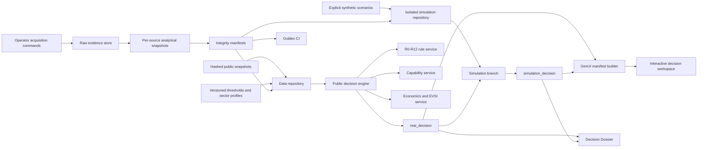
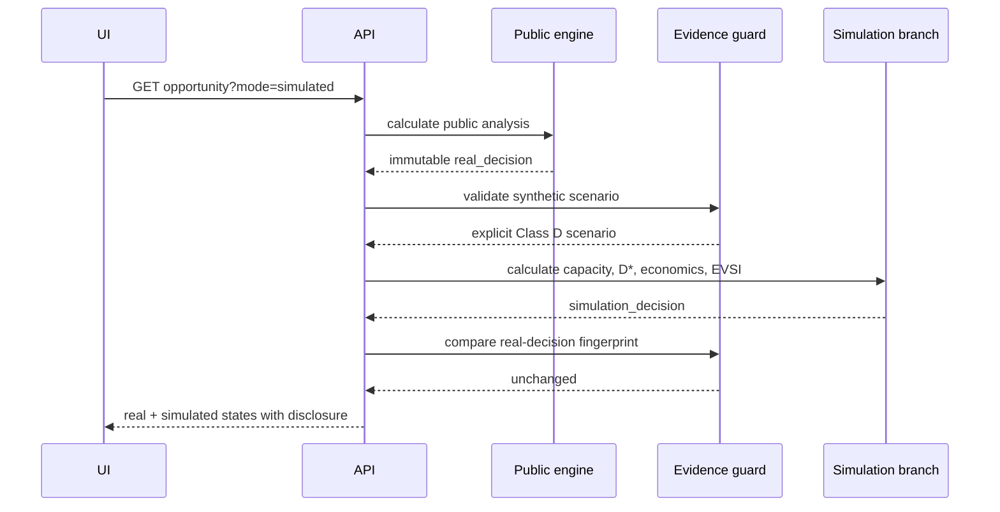

# 03 — System Architecture

<!-- core_version: 2.0.0; supersedes: 1.0.0; effective_date: 2026-09-02 -->

## 1. Architectural objective

The architecture must demonstrate the complete reasoning chain without requiring live Ministry connectivity:

```text
Frozen public evidence
→ harmonised opportunity record
→ deterministic R-rule ledger
→ specification and evidence controls
→ capability test
→ economics / intervention / EVSI
→ decision state and route
→ adaptive decision surface
→ Decision Dossier
```

A separate synthetic branch demonstrates the effect of Ministry-grade data without contaminating the public result.

## 2. Design principles

1. **Evidence before interface.** UI components render structured decisions; they do not infer them.
2. **Deterministic calculations.** Arithmetic, thresholds, state transitions and route gates are code, not free-form model output.
3. **Fail closed.** Missing evidence reduces the permitted decision.
4. **Dual-state isolation.** Public and simulation decisions coexist; one never overwrites the other.
5. **Frozen demo inputs.** No live external dependency can change a golden outcome during a presentation or CI run.
6. **Small approved GenUI library.** The surface adapts by selecting components from a controlled registry.
7. **Platform-independent domain core.** FastAPI and the static frontend are replaceable adapters around the same engine.

## 3. Logical architecture



## 4. Runtime components

### 4.1 Configuration layer

Files:

- `config/project.yaml`
- `config/thresholds.v1.yaml`
- `config/sector_profiles.v1.yaml`
- `config/evidence_policy.v1.yaml`

Responsibilities:

- identify the decision cycle;
- provide threshold values and metadata;
- define sector weights and hard gates;
- enforce evidence classes and synthetic isolation.

### 4.2 Data repository

Module: `data_repository.py`

Responsibilities:

- load public snapshots;
- load synthetic scenarios only from the synthetic directory;
- reject incorrectly flagged artifacts;
- expose opportunity IDs and extraction fixtures;
- cache immutable files for local performance.

The repository does not merge public and synthetic data. It returns them through separate methods.

### 4.3 Evidence guard

Module: `evidence.py`

Responsibilities:

- verify that public evidence is explicitly non-synthetic;
- verify mandatory synthetic metadata;
- produce synthetic evidence ledger rows;
- fingerprint the real decision before simulation;
- assert that the real decision remains unchanged afterward.

### 4.4 Rule service

Module: `rules.py`

Responsibilities:

- evaluate every R-rule;
- return execution state and decision effect;
- perform price–quantity decomposition;
- prevent R4-D from becoming a grade claim;
- surface disabled rules instead of hiding them.

### 4.5 Capability service

Module: `capability.py`

Responsibilities:

- calculate effective qualified capacity;
- apply sector profile weights;
- calculate K, U, Dknown and internal D\*;
- withhold published D\* when Kmin or hard gates fail;
- assign a route band only when permitted.

### 4.6 Economics and EVSI service

Module: `economics.py`

Responsibilities:

- NPV and IRR;
- deterministic search for S\*;
- incremental national value;
- approximate EVSI.

The service accepts structured inputs and returns structured outputs. It does not choose a preferred policy on narrative grounds.

### 4.7 Decision orchestrator

Module: `decision_engine.py`

Responsibilities:

- run public analysis first;
- assign the public state;
- optionally run the isolated simulation branch;
- apply route and competition gates;
- preserve both states;
- provide one response contract to API, dossier and GenUI.

### 4.8 Dossier service

Module: `dossier.py`

Responsibilities:

- build the structured Decision Dossier;
- produce printable HTML;
- disclose synthetic evidence in simulated mode;
- preserve snapshot and integrity metadata.

### 4.9 GenUI manifest service

Module: `genui.py`

Responsibilities:

- select approved UI components based on decision context;
- omit unavailable panels rather than showing invented values;
- communicate evidence mode and state transition;
- prohibit arbitrary generated executable code.

### 4.10 Web/API adapter

Module: `app.py`

Responsibilities:

- expose health, project, threshold, opportunity, manifest, dossier and extraction endpoints;
- expose the manifest-verified, mode-independent public S15 selection through `GET /api/case-selection` with no caller-provided file path;
- mount four public-only screening reads before the SPA fallback:
  `/api/screening`, `/api/screening/queues/{queue_id}`,
  `/api/screening/records/{hs6}`, and `GET /api/screening/evidence`;
- serve the offline frontend;
- provide OpenAPI documentation.

### 4.11 Acquisition module

Package: `src/ior_mvp/acquisition/`

Responsibilities:

- explicit operator-only live fetch through `transport.assert_live_permitted`;
- deterministic raw store with query hash, run id, page contracts and coverage records;
- latest-run-per-source-stage-unit selection (`LATEST_RUN_PER_SOURCE_STAGE_UNIT`);
- per-source analytical snapshot builders for universe, tariff and partners kinds;
- acquired evidence passports with eight §11 groups;
- offline reconstruction proof via `scripts/reconstruct_snapshot.py`.
- S12c entity resolution is an offline acquisition subpackage: operator-authored verbatim mentions produce write-once, byte-reconstructible `data/entities/` artifacts; engine consumption remains deferred to S13/S14.

BACI BULK is raw-only in S11: stored as hashed evidence with no analytical snapshot kind.

- S12a uses stage and kind registries for acquisition, validation, per-source snapshot building, loading and reconstruction, adding production, directory and registry kinds without integrating them into the public decision engine.
- S12b adds `Stage.DOCUMENT`, DocumentList/DocumentRecord stores under `data/documents/**`, text-layer derivation (dev-only `pypdf`) and document reconstruction on the same raw-store and passport machinery without integrating documents into the public decision engine.

## 5. Public analysis sequence

```mermaid
sequenceDiagram
    participant UI
    participant API
    participant Repo
    participant Rules
    participant Capability
    participant Decision

    UI->>API: GET opportunity?mode=public
    API->>Repo: load frozen public case
    Repo-->>API: public record + evidence
    API->>Rules: evaluate R0-R12
    Rules-->>API: rule ledger
    API->>Capability: evaluate public states
    Capability-->>API: K/U; D* withheld if gated
    API->>Decision: assign evidence-bounded state
    Decision-->>API: real_decision
    API-->>UI: analysis + UI manifest
```

## 6. Simulation sequence



## 7. GenUI architecture

The MVP interprets GenUI as a **runtime-composed interface from approved building blocks**.

The backend emits:

```json
{
  "surface": "industrial_decision_workspace",
  "context": {"mode": "simulated", "decision_state": "ADVANCE"},
  "components": [
    {"type": "integrity_banner", "props": {}},
    {"type": "decision_hero", "props": {}},
    {"type": "trade_chart", "props": {}},
    {"type": "capability_matrix", "props": {}},
    {"type": "economics_panel", "props": {}}
  ]
}
```

The browser has renderers only for approved types. A model cannot inject scripts, arbitrary HTML or unreviewed controls.
The S13b registry additionally owns `screening_summary`, `screening_queue` and
`screening_record` renderers. A null deep-decision state is displayed through
its governed screening disposition chip, not by inventing a formal state.
The S17 registry appends one `graph_view` descriptor after `decision_actions`.
It is collapsed by default, makes no graph request until opened, and renders
only the four fixed catalogue views through deterministic SVG plus equivalent
native HTML controls.

Context rules include:

- public mode → no economics panel when economics is unavailable;
- simulated mode → integrity banner and synthetic warning mandatory;
- `INVESTIGATE` → emphasize missing facts and EVSI;
- `REJECT` → emphasize the falsifying evidence and avoided intervention;
- `ADVANCE` → show conditions, S\*, national value and kill conditions.

### 7.1 S18b executive presentation registry

`/executive` selects a dedicated vanilla ES-module surface while `/` retains the
analyst workspace. The fixed registry renders exactly eight executive steps:
SIGNAL, FALSE_POSITIVE_CONTROLS, PUBLIC_CONCLUSION, MISSING_MINISTRY_FACTS,
SIMULATED_EVIDENCE, ROUTE_COMPARISON, INTERVENTION and CONDITIONS_AND_KILL.
Four separate vectors remain expandable dimensions, never a combined score.
Only reviewed renderers and escaped values enter the DOM; the API cannot supply
HTML or a new component type.

The executive summary owns integrity, public dataset counts and synthetic EVSI
availability. Selected-case executive and public analysis responses are joined
by opportunity and snapshot; a simulated analysis is requested only when its
branch is available. That response must preserve the complete `real_decision`
and match scenario, state, route, evidence membership and policy metadata.
Analysis supplies existing localized narratives, route reasons, trade,
capability, economics and source passports, not replacement summary counts.
A failed join clears the display and offers retry; it never retains another
case's claims. A monotonic context epoch binds case, step and locale changes;
late responses cannot restore stale content. Failed locale loads retain the
last complete language/context, and browser history restores the same selection.

Public and simulated decisions remain separate, with Class D, scenario identity
and both policy labels on simulated results. Missing route/economics values
retain typed absence; available zero is displayed as zero. Route hypotheses and
all nine routes preserve engine order and precedence. Claims resolve only to
matching current public or current-scenario passports. Linked public
contradictions remain visible inside simulated claims. Unresolved rules show
case-wide unmet needs without asserting a rule-specific source relationship.

Analyst metric, rule and decision links reuse these validated claim boundaries.
An explicit native graph link carries only validated opportunity/mode/view
parameters and opens the existing graph after matching analysis loads. It makes
no arbitrary graph query and supplies no artifact fallback for an unavailable
live graph. Portfolio integrity uses the executive summary's actual count and
PASS/FAIL state; request failure is unavailable, never a fabricated zero.

S18b AM5 integrity is a persistent executive region derived from the current summary: PASS shows the actual zero count; FAIL shows the actual total, all ordered named checks/counts and affected IDs; unavailable never reuses an earlier PASS. A valid failure notice does not rewrite decisions or disable the journey. Analyst source context additionally requires exact public/active/simulation state, route and scenario consistency, preserving null versus route0. Screening passports retain their stored reviewer-status identity while rendering its governed locale text. These boundaries do not calculate evidence or relax source/parity checks.

Parent-scope completeness includes each vector's ordered actual claims and statuses, and genuine no-scenario absence: an unavailable synthetic projection joins no EVSI row, carries no fabricated metadata, and keeps the real public decision usable. Available scenarios still require exact EVSI/scenario membership. Source drills preserve contradictions and return focus; the eight-step registry and all industrial computation remain unchanged.

## 8. Deployment architecture

No external API call occurs at runtime. Public acquisition runs only through explicit operator commands (`ior_mvp.acquisition` CLI or Makefile acquire targets) with `IOR_ACQUISITION_LIVE=1`; tests and CI never invoke live fetch.

### 8.1 POC

- one Python process;
- FastAPI + static assets;
- local immutable JSON/YAML files;
- no database;
- no external API call;
- no authentication;
- local WSL or Docker.

### 8.2 Production evolution

The same contracts can be deployed as:

- ingestion jobs and raw object storage;
- relational/graph persistence;
- deterministic calculation services;
- controlled LLM extraction workers;
- workflow and authorization service;
- role-based web application;
- immutable decision snapshot store.

The MVP does not lock the Ministry into a particular cloud or data platform.

## 9. Trust boundaries

| Boundary | Control |
|---|---|
| Public source → raw store → snapshot | query hash, deterministic compression, SHA-256, coverage record, latest-run selection per source, offline guard |
| Snapshot → rule engine | schema validation and immutable load |
| Synthetic directory → simulation | explicit flag, Class D, scenario ID and source restriction |
| Simulation → real decision | deep copy, fingerprint and post-run assertion |
| AI extraction → record | schema, exact source spans, second-pass/golden gate |
| Engine → UI | structured manifest from approved component types |
| Recommendation → public action | accountable human authorization outside the POC |

## 10. Failure behavior

- unknown opportunity → 404;
- missing data artifact → repository error;
- malformed config → startup or request failure;
- missing synthetic metadata → fail closed;
- unresolved capability hard gate → D\* not published;
- support search cannot satisfy hurdle → no S\* and no ADVANCE;
- hash mismatch → integrity failure before demo/release;
- UNAVAILABLE attempt record persisted with reason and observed response;
- INCOMPLETE latest-run coverage → no universe/tariff snapshot for that source;
- reconstruction mismatch or changed latest-run selection → integrity failure (exit 1 / SELECTION_CHANGED);
- missing, changed or malformed pinned case-selection evidence → typed HTTP 422 `CASE_SELECTION_INTEGRITY_ERROR` with no partial or stale successful projection.

## 11. Scaling path

The engine is stateless at request time and can be separated into services when data volume grows. The first production bottleneck will not be arithmetic; it will be evidence acquisition, entity resolution and specification review. The architecture therefore preserves evidence passports and hard-gate status as first-class objects rather than optimizing prematurely for model throughput.

## 12. S13a screening runtime boundary (mounted in S13b)

The offline builder under `ior_mvp.screening` may read acquired snapshots,
documents and entity artifacts. The runtime loader, snapshot validator,
configuration reader and API router do not import
`ior_mvp.acquisition.transport`. The summary, queue and record routes are
mounted in S13b before the primary application's SPA fallback. The additive
`GET /api/screening/evidence` route returns the snapshot's universe
evidence passports verbatim, its universe-unit coverage, an explicit
`source_boundary=public` and `synthetic_flag=false`; without a snapshot it
returns an empty typed `NO_SCREENING_SNAPSHOT` payload. It accepts no evidence
mode and does not alter the three S13a route contracts.

An unavailable universe is a successful typed runtime condition: the summary
returns HTTP 200 with `universe_status=UNAVAILABLE`, empty queues and the latest
recorded reason. Unknown queue and HS6 identifiers return typed 404 responses.

## 13. Graph projection runtime

The governed graph has two layers:

1. `data/graph/` is the canonical, offline, hashable and reconstructible
   projection of public snapshots, Class-D scenarios, entity artifacts,
   CaseBrief spans, screening identity and tariff-attempt state.
2. Neo4j mirrors that exact projection for Cypher views. Local Compose, the
   isolated CI service container and the owner-authorized Aura deployment
   target use the same idempotent loader and verification contract.

The deterministic engine and existing opportunity endpoints do not open a
graph socket. They consume branch-qualified shared-enabler inputs from the
cached, validated governed artifact in-process. The mounted `graph.api.router`
uses live Neo4j only for the fixed graph-view endpoints. This preserves the
offline demo and warm-response requirements.

The project-owned Compose service is
`industrial-mvp-neo4j`, pinned to the recorded Neo4j 5.26.30 image digest, on
loopback host ports 7475/7688 with a dedicated volume and network. Its
credential is generated once into a git-ignored mode-0600 file and handed to
the container through the `NEO4J_AUTH_FILE` secret pattern. Because local
Compose preserves the host file owner, a root entrypoint stages a mode-0400
runtime copy owned by the Neo4j uid before the vendor entrypoint runs; the
credential value is never printed.

Targets `compose` and `ci` ignore inherited `NEO4J_URI` and always resolve to
`bolt://localhost:7688`. Aura is an operator-only deployment target under
OR-7. Its `neo4j+s` host prefix, `AURA_INSTANCEID`, and explicit
`--confirm-instance` must agree before driver creation or any write.
`DETACH DELETE` is unavailable without an exact target-scoped
`--confirm-clear`.

The loader creates Community-compatible uniqueness constraints for all 19
labels, per-label indexes, and uses `MERGE` by governed node and relationship
ids. A second load creates zero nodes and zero relationships. It refuses a
different live projection before any write; replacement requires an explicit
clear of the dedicated target. Live verification checks label/type counts,
provenance on every element, the public/Class-D partition, and the projection
identity.

When configuration, the optional driver, connectivity, instance identity or
projection equality is unavailable, `GraphService` returns HTTP 200 with
`graph_status=GRAPH_UNAVAILABLE`, a typed reason code and empty view elements.
It never substitutes artifact results for a failed live view and never
swallows the test-suite `OfflineGuardViolation`. The fixed bilingual view
catalogue remains available while the service is down.

## 14. Interactive graph-view adapter

The browser graph adapter keeps an independent request epoch and the complete
`(opportunity_id, mode, view_id)` context. Opportunity, mode, view, closure and
evidence-selection transitions clear obsolete graph and passport content
synchronously. Both successful and failed asynchronous responses must still
match the current epoch, complete context and selected element before they may
update state or a context-local cache.

The client rejects duplicate IDs, dangling edges, response-context mismatch
and any synthetic node or edge in a public payload. The live serializer applies
the same branch boundary to `SUPPORTED_BY_EVIDENCE` edges and derives the
top-level synthetic marker and bilingual policy warnings from all returned
nodes and edges. A failed live view never falls back to artifact or fixture
rows.

Graph evidence references are the deduplicated union of element provenance,
property references and the matching drill-down entry. They resolve only
against stored evidence rows from the current analysis or existing analysis
endpoints for visible portfolio products. Conflicts remain opportunity-qualified
records; missing references and document addresses remain explicit. External
links accept only HTTP or HTTPS and every rendered value is escaped.

Ordinary browser tests use clearly identified serialized artifact fixtures; the
only invented nonempty route-blocking relationship is test-only, simulated and
Class D. A separate `graph_ui` loopback test uses no response interception,
verifies the preloaded projection before Chromium, compares rendered IDs with
actual live responses in both locales, and verifies the unchanged mirror again
afterward. The default browser child environment remains credential- and
graph-stripped; its guarded test adapter accepts only `compose` or `ci`.


### S18b AM2 refinement of §14: graph names and contained navigation

Graph node names use one shared presentation helper. Arabic uses a real Arabic name when present, then the verbatim English source name, then the localized node kind; English uses a real English name or the localized kind. Exact trimmed `UNAVAILABLE`, empty and malformed nonstring names are absent. This does not translate or invent company names. Each Arabic fallback has individually annotated SVG text/title with adjacent source-caption metadata and a separately visible native caption linked to the complete accessible name. The whole graph keeps its locale direction. Stable IDs, graph semantics, geometry, selection and stored-evidence resolution are unchanged.

The graph panel has a zero-minimum grid track; native controls, identifiers and source captions wrap inside the panel. The intrinsic SVG remains in its named, keyboard-focusable horizontal scroll region with a localized instruction; complete native nodes and relationships remain available beneath it. Narrow-layout support preserves the diagram's geometry and public/synthetic boundaries.


### S18b AM4 typed evidence presentation

The existing shared graph passport renderer serves both graph selections and executive source panels. Stored titles/source prose/supports/contradictions are escaped and individually language-annotated, with visible adjacent Arabic source captions; title references expose sibling captions through aria-describedby. Genuine Arabic and mixed source runs preserve their original text. Exact IDs, governed source codes, periods and dates use isolated technical values. Seven declared evidence statuses and the one unconfirmed reviewer state are localized without promoting unknown states or evidence classes. Unresolved references remain unresolved; document-address zero indexes are preserved. Public/synthetic branches retain qualified reference lookup, both actual policy labels, anchors and native return focus.

The analyst evidence and methodology tables are named native keyboard scroll regions. The executive simulated capability section adds a native expandable0/1/2/3/U meaning legend sourced from DOCX§6.4, with original codes/dimensions and unknown unavailability retained. Its explicit simulation note and policy warnings do not confer Ministry verification. No domain computation, API, graph geometry, source evidence or global parity checker changes follow from these presentation additions.
