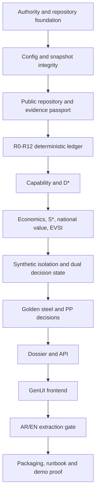

# Project Build Overlay

## 1. Relationship to reusable build machinery

This document adds only project-specific content. It does not redefine Flight Control, the Universal New-Project Guide, reviewer independence, remediation limits, CI behavior or task-state storage.

External references:

```text
${FLIGHT_CONTROL_HOME}
${UNIVERSAL_NEW_PROJECT_GUIDE}
```

When the autonomous supervisor starts a slice, the generic machinery governs the lifecycle. This overlay tells it what must be read and what industrial-decision invariants must be preserved.

## 2. Mandatory project reading

Every slice reads:

1. `AGENTS.md`
2. `docs/authority/00_AUTHORITY_MANIFEST.md`
3. the relevant methodology section
4. the mapped core specification
5. affected configuration and golden fixture

The implementer must state the methodology requirement, implementation target and tests before writing.

## 3. Domain DO-NOTs

- Do not duplicate Flight Control or task-state schemas locally.
- Do not move thresholds into code.
- Do not query live sources inside golden tests.
- Do not treat synthetic evidence as official.
- Do not let simulation mutate `real_decision`.
- Do not publish D\* below Kmin or with unresolved hard gates.
- Do not turn R4-D into a grade claim.
- Do not propose supported greenfield before lower-cost routes.
- Do not add generic AI chat to the MVP.
- Do not add screens beyond the adaptive decision workspace unless a demonstrated user need requires them.

## 4. Slice dependency graph



## 5. Slice acceptance summaries

### S01 — Authority and repository foundation

- governing DOCX copied unchanged;
- searchable mirror generated;
- ten-document core present;
- external build assets referenced, not copied.

### S02 — Config and snapshot integrity

- thresholds and profiles versioned;
- public/synthetic/golden snapshots hashed;
- integrity script fails on mismatch.

### S03 — Repository and evidence

- separate public and synthetic loaders;
- mandatory flags validated;
- no cross-directory merge.

### S04 — Rule ledger

- all R-rules visible;
- formula tests;
- correct FULL/DEGRADED/DISABLED states.

### S05 — Capability

- exact effective capacity;
- unknown penalty;
- hard-gate publication control;
- sector weights loaded from config.

### S06 — Economics and EVSI

- NPV/IRR/S\* deterministic;
- national value and competition visible;
- EVSI named fact.

### S07 — Synthetic isolation

- dual decision states;
- fingerprint assertion;
- visible warning and scenario metadata.

### S08 — Golden decisions

- steel/public `INVESTIGATE`;
- steel/simulated `ADVANCE` with real unchanged;
- PP/public and simulated `REJECT` generic capacity.

### S09 — Dossier and API

- structured and printable dossier;
- OpenAPI endpoints;
- error behavior.

### S10 — GenUI

- approved manifest component types;
- mode toggle and adaptive panels;
- responsive, professional interface.

### S11 — Bilingual extraction

- source spans retained;
- four-field golden gate passes;
- production LLM adapter boundary documented.

### S12 — Packaging

- clean start script;
- Docker support;
- tests and smoke pass;
- zip produced.

## 6. Current packaged status

All twelve MVP slices are implemented in this package. The graph remains the supervisor’s reference for future extension and regression isolation.

## 7. Future autonomous slices

Recommended next slices after the POC is accepted:

1. ZATCA 12-digit tariff-tree ingestion.
2. Comtrade/BACI/GASTAT snapshot acquisition pipeline.
3. Saudi producer and plant entity graph.
4. Etimad/SABER bilingual extraction corpus.
5. Live standards and document evidence passport.
6. 25–50 opportunity public screening universe.
7. Secure Ministry connector and staging environment.
8. Real approved-deal calibration corpus.
9. Accountable review/approval workflow.
10. Outcome ledger and recalibration.

Each future slice must preserve the current golden fixtures as historical regressions.
