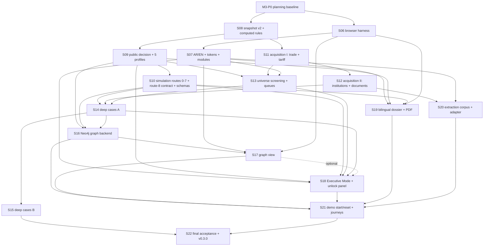

# v0.3.0 — Ministerial Demonstration Readiness: Slice Graph

**Status:** APPROVED WITH AMENDMENTS by the owner on 2026-09-02 (OD-2). The owner's rulings R-1 to R-6 and the amended interpretations I1 and I5 (`GAP_ANALYSIS.md` §7 and §7A; ADR-010) are incorporated below. Execution begins with the docs-only M3-P0 PR; S06 implementation starts only after M3-P0 is merged with green default-branch CI.
**Companion:** `GAP_ANALYSIS.md` (gap IDs A1…G7, uncovered statements §5, authority inventory §6, interpretations I1–I8, owner rulings §7A).
**Numbering:** v0.2.0 ended at S05. v0.3.0 slices are S06–S22. Each slice is one branch `slice/SXX-<slug>`, one PR, one squash merge.

---

## 1. Milestone governance

The existing Flight Control workflow of v0.2.0 continues unchanged; no generic machinery is added to the repository.

| Step | Seat | Model | Output |
|---|---|---|---|
| Select slice; start-of-slice ritual; persona | Supervisor | Claude `claude-fable-5-1-thinking-max` | `.workflow/slices/SXX-<slug>/persona.md`, `context.md` |
| Plan (no implementation) | Planner | GPT-5.6 Sol `gpt-5.6-sol-max` | `plan.md` |
| Plan review to zero findings | Supervisor | Claude | `plan_review.md`; `PLAN_APPROVED` |
| Implement only the approved plan; stay uncommitted | Implementer | GPT-5.6 Sol | `implementation_log.md`, `test_evidence.md` |
| Implementation review | Supervisor | Claude | `implementation_review.md` |
| Independent read-only review | Reviewer | Grok 4.6 `cursor-grok-4.6-xhigh` | `reviewer_findings.md` (seven-field findings; APPROVE only at zero) |
| Fix loop → local gates → commit → push → PR → hosted CI → squash merge → durable state | Supervisor | Claude | `pr_record.md`, `completion.md`, `.workflow/state.json`, control documents |

Rules: no seat approves or merges its own work; the Supervisor never approves a plan or candidate it authored; finite ladders (four plans, eight implementation candidates) then `BLOCKED_FOR_OWNER`; red, missing or non-terminal CI never advances; candidate identity (changed files + hashes) is recorded when the implementer stops and re-verified after the reviewer's verdict.

Every slice PR states: slice, objective, requirements, implementation, data/schema impact, API/UI impact, test evidence, validator evidence, review status, screenshots where relevant, explicit non-goals. Any slice that touches `config/*.yaml`, `data/**`, `docs/core/**` or a golden expectation carries an ADR that justifies the Manifest §7 change, runs `scripts/build_manifests.py` once after regression, and shows the two public golden outcomes unchanged.

Local gates before every PR: `make ci` (prohibited-file scan, threshold-literal scan, compile, JS syntax, integrity, Gate B, pytest, smoke) plus, from S06 onward, the browser gate, and from S16 onward, the graph gate.

Binding owner rulings for every slice (ADR-010; `GAP_ANALYSIS.md` §7A): R-1 ADVANCE is evidence-gated, never source-type-gated; R-2 no route 8 before the real graph; R-3 Neo4j is a governed, idempotently rebuildable projection of canonical evidence, never a second source of truth; R-4 governed visual baselines are set in S07, S06 keeps reference screenshots only; R-5 a routes 0–8 coverage matrix is audited in S22 and any undemonstrated route returns to the owner; R-6 project-owned, pinned, health-checked Neo4j provisioned by the build with git-ignored generated credentials.

## 2. Planning-baseline PR (docs only, before S06)

**M3-P0 — v0.3.0 planning baseline.** Commits `docs/milestones/v0.3.0/GAP_ANALYSIS.md` and `SLICE_GRAPH.md`; adds a "Milestone v0.3.0" section to `docs/BUILD_ROADMAP.md` referencing them; adds a `milestones.v0.3.0` block to `.workflow/state.json` (state `NEXT_SLICE`, next `S06`) without altering any v0.2.0 field; appends the owner's OD-1/OD-2 approval record to `docs/ARCHITECTURE_DECISIONS.md` as ADR-010 (core v2 authorization). No code, config, data or core change. Merged by the Supervisor after hosted CI is green (docs-only PRs still run the full CI).

## 3. Slices

Each row is one vertical, independently reviewable slice. "Closes" lists gap IDs from `GAP_ANALYSIS.md` and v0.2.0 known limitations. "Authority" lists Manifest §7 changes the slice must carry through the change gate.

### S06 — Real-browser acceptance harness (Chromium)

- **Objective:** A Ministry operator can run one command that drives the existing v0.2.0 workspace in real Chromium and fails on any console error, failed request, inaccessible control or broken keyboard path, at desktop, tablet and presentation widths, including dossier print and PDF — and records reference screenshots of the v0.2.0 baseline.
- **Outcome areas:** A1, A2 (existing controls), A3, A4, A5, A6 (reference screenshots only). Closes KL-22.
- **Scope:** Playwright test layer in the project toolchain (planner chooses Python `pytest-playwright` or Node Playwright and justifies it against `uv`/CI); browser install step in CI as a fourth required job; journeys: portfolio load, every case selector, both evidence modes, dossier JSON/HTML action, printable dossier `@media print` and Chromium PDF export, keyboard traversal with visible focus on every interactive control, RTL span rendering, widths 1440 / 1024 / 1920 and 2560; console-error and failed-request hooks fail the test; axe-core accessibility check fails on violations; **reference screenshots** of the principal v0.2.0 journeys are captured and stored as documentary evidence, not as a pass/fail oracle (owner ruling R-4: the governed visual-regression baselines are established in S07 after the redesign, so the oracle is not obsoleted one slice later). Existing UI is fixed only where the browser gate reveals a defect; every fix is recorded.
- **Depends on:** M3-P0.
- **Authority:** none (Core 09 §2.7 already designates Playwright as the production addition; TL-07 scope statement and KL-22 updated in control docs).
- **Gates/tests:** browser job green in CI; all v0.2.0 gates unchanged; 280 existing tests unchanged.
- **Non-goals:** no Executive Mode, no language switch, no visual redesign, no governed visual-regression oracle.

### S07 — Bilingual interface foundation (AR/EN, RTL, tokens, decomposition)

- **Objective:** The analyst can switch the whole interface between Arabic and English with full content parity and correct bidirectional layout, on a token-only, modular frontend that meets the firm interface rules, with no behavioural regression.
- **Outcome areas:** A3, A8, A10, G7. Closes KL-21.
- **Scope:** ES-module decomposition of `app.js` into components under 200 lines with named exports; design tokens only (zero hex/spacing/font literals outside the token layer, enforced by a scanner test); governed bilingual string catalogue (versioned, hashed YAML) for all UI chrome; `lang`/`dir` switching with persisted choice; offline Arabic-capable font stack (system fonts, or a vendored open-licensed font with its license file); `evidence_policy` 1.2.0 adds the Arabic synthetic display label and every synthetic marker renders in both languages; Playwright parity tests (every journey in both locales, RTL screenshots); **the governed visual-regression baselines for the v0.3 UI are established here** (owner ruling R-4) for both locales and all widths, with a documented, reviewer-approved update procedure — baselines are oracles governed like goldens.
- **Depends on:** S06.
- **Authority:** `evidence_policy.v1.yaml` 1.1.0 → 1.2.0 (§7.3); new governed string catalogue (§7.3); Core 01 v2 NFR-007 extension.
- **Non-goals:** no new analytical content; no Executive Mode.

### S08 — Public snapshot schema v2 and computed rule ledger

- **Objective:** A new governed public snapshot with partner-level trade rows and typed producer/criticality/flow evidence is analysed by rules computed from evidence — not from author flags — while the two golden cases, re-expressed in the new schema from the same frozen facts, produce identical rules, metrics and states.
- **Outcome areas:** C1, C2 (rules), D2, D4, D7 (formulas), D12; uncovered §3.3 formulas, R2 CAGR.
- **Scope:** Core 04 v2 public snapshot schema (partner × year × flow rows with value, net weight, unit and validity flags; producer evidence typed; criticality designation field; optional production/retained/domestic-origin flows with explicit `UNAVAILABLE`); rules computed from fields: R4-D from weighted dispersion/coverage/partner-mix metrics, R5 from coexistence plus §3.3 retained-import/apparent-consumption/penetration formulas (NOT_CALCULABLE when inputs are absent), R9-S from producer process-family and signal evidence, R10 from a responsible-authority designation field, R11 from export/import ratio plus established-capability evidence; R3 on value and quantity bases (I2); R2 CAGR over the observed span (I3); R1-D confidence cap read from configuration (KL-30); `rule_context` removed; contradiction register projected into dossier JSON and HTML (D4). Golden snapshots re-issued as v2 under new snapshot IDs from the methodology's frozen §13/§14 facts; v1 files retained byte-identical as history; fields the methodology does not supply (e.g., partner quantity rows for quantity HHI) stay `UNAVAILABLE` rather than being invented.
- **Depends on:** M3-P0 (parallel to S06/S07).
- **Authority:** Core 04, 07, 02, 09 v2 (§7.4); `data/snapshots/public/*` v2 files (§7.5); manifests.
- **Gates/tests:** golden equality tests (states, fired rules, ΔlnV/ΔlnQ/ΔlnUV, HHI 0.36, ratio 50.6×) against v2 snapshots; boundary tests for the new computed rules; dossier contradiction tests.
- **Non-goals:** decision selection still consumes the authored `public_decision_contract` until S09.

### S09 — Generalized public decision algorithm and five sector profiles

- **Objective:** The public decision state, gap class, missing facts, route hypotheses and kill conditions are computed from evidence under Core 07 v2 §7.1 for any conforming snapshot; `MONITOR` exists; the evidence-policy ADVANCE gate executes on evidence class rather than on evidence source type; all five methodology sector profiles are loaded and tested — with steel `INVESTIGATE` and PP `REJECT` route 0 reproduced by computation.
- **Outcome areas:** C1, C2, C4 (public), C5 (public hypotheses), C8, D1, D3, D9 (public), uncovered §4.2, §5.3, §12. Closes KL-20, KL-23 (public), KL-24. Implements owner ruling R-1.
- **Scope:** evidence-class assessment of the four decision-critical fields from passports; executed `advance_gate`: **`ADVANCE` is evidence-gated, not source-type-gated** — a public case whose decision-critical fields are all Class A/B/C and which passes every methodology gate (identity, demand at specification, capability with Kmin and resolved hard gates, unsupported-then-supported economics, national value, competition, additionality) technically reaches a real `ADVANCE`; any decision-critical field at Class D/E blocks it; synthetic Class D evidence can only ever produce `simulation_decision` (no v0.3.0 demonstration case is required to reach a real public `ADVANCE`); six hard-exclusion checks (I7); gap-taxonomy classifier (I6); `MONITOR` condition and the screening disposition per amended I1 (a formal `REJECT` requires an evidenced rejection condition or hard exclusion; `MONITOR` requires a named observable future trigger; unresolved or contradictory decision-critical fact with positive evidence value → `INVESTIGATE`); §7.1.1 route sequence evaluated in the public branch as hypotheses with `passes/fails/NOT_CALCULABLE` and the amended I5 selection rule (precedence gates, then highest defensible incremental national value among feasible, additional, permissible alternatives — never "first passing route wins"); computed missing facts from unresolved fields and gates; kill conditions and decision text from a governed bilingual narrative catalogue; `public_decision_contract` removed; `sector_profiles` 1.1.0 with pharma/API, fertilizers and fabricated aluminium (§6.3 weights; hard gates derived from §6.3 text) plus per-profile boundary tests.
- **Depends on:** S08.
- **Authority:** Core 07, 01, 02, 09 v2; `sector_profiles.v1.yaml` 1.0.0 → 1.1.0; `evidence_policy` field-class contract (if not already in S07); narrative catalogue.
- **Gates/tests:** goldens exact by computation; MONITOR/REJECT/INVESTIGATE/SCREENED_OUT selection tests on synthetic-free fixture snapshots that exercise each branch; ADVANCE-gate tests in both directions — a fixture with all-A/B/C decision-critical evidence passing every gate reaches `ADVANCE`, and the same fixture with any one decision-critical field at D or E does not; hard-exclusion tests with `NOT_CALCULABLE` inputs never passing; a test that no public code path is conditioned on evidence source type.
- **Non-goals:** simulation branch unchanged (S10).

### S10 — Generalized simulation branch: routes 0–7, the route-8 contract, R8, allocation and expansion schemas

- **Objective:** A Class-D scenario can declare tariff-line and buyer allocations, an explicit expansion assumption, base demand with commitment probabilities and MES, production and retained flows, and "class-if-confirmed" evidence, and the isolated branch selects any of routes 0–7 or `MONITOR` through the mandatory sequence and the amended I5 selection rule, while exposing the governed route-8 contract that returns `NOT_CALCULABLE` / `GRAPH_REQUIRED` until the real graph exists — and both packaged scenarios, migrated unchanged in value, still yield `ADVANCE` route 5 and `REJECT` route 0 with identical numbers.
- **Outcome areas:** C3 (schemas), C5 (routes 0–7), C7, D5, D6, D8, D9, uncovered §6.6, §7.5. Closes KL-25, KL-27, KL-28, KL-23 (simulated). Implements owner ruling R-2.
- **Scope:** scenario contract 2.0.0 (Core 06 v2) with the optional governed blocks; reconciliation extended (tariff lines sum to the HS6 total; buyer quantities within public imports; expansion assumption disclosed and bounded); R8 FULL/DEGRADED when its inputs exist; R5 in the simulated ledger; simulation ADVANCE gate on declared confirmed classes (I4, actual class always D); binding-constraint detection and §7.4 mapping evaluated in §7.1.1 order with the amended I5 rule — precedence gates first (a lower-cost route that fully resolves the binding constraint prevents escalation; financial support only after unsupported and applicable non-financial routes fail), then selection of the highest defensible incremental national value among the remaining feasible, additional and permissible alternatives subject to downside, competition, distortion, proportionality and evidence gates; **route 8 is implemented only as the governed contract** (inputs: shared enabler identity, dependent opportunities, P(i,e), ΔNV_i, DependencyShare, Cost(e)) whose evaluation returns `NOT_CALCULABLE` with reason `GRAPH_REQUIRED` until S16 supplies it from real Neo4j dependency queries — no in-memory or JSON substitute may satisfy route coverage; §6.6 counterfactual answers as typed fields; §7.5 non-additionality and concentration-before/after checks where inputs exist; `MONITOR` in simulation; Gate B and ground-truth back-test extended to routes 0–7.
- **Depends on:** S09.
- **Authority:** Core 06, 07, 09 v2; `data/synthetic/*` contract migration (§7.3 scenario parameters, numeric inputs unchanged); manifests.
- **Gates/tests:** steel/PP simulated exacts unchanged; per-route selection tests for routes 0–7 with fixture scenarios including a case where two routes pass and the higher-ΔNV route is selected, and a case where a lower-cost fully-resolving route blocks escalation; a test that route 8 returns `GRAPH_REQUIRED` and cannot be selected; reconciliation FAIL tests for each new block; R8 boundary tests (0.20 addition, 0.25 MES fill).
- **Non-goals:** no route-8 activation; no new cases yet (S14/S15).

### S11 — Public acquisition pipeline I: framework, trade sources, tariff hierarchy

- **Objective:** An analyst runs explicit commands that acquire Saudi trade data (UN Comtrade or WITS; BACI where its license permits) and the Saudi tariff hierarchy, store every raw response with hash, query contract, retrieval date, source refresh date and license note, harmonise per Core 05 §6, and produce hashed analytical snapshots that a reconstruction script proves reproducible from the stored raw artifacts — while runtime and CI remain offline.
- **Outcome areas:** B1, B2, B3 (trade + tariff), B4. Uncovered §11 passport fields.
- **Scope:** `ior_mvp/acquisition/` implementing Core 05 §10 `SourceConnector` (`acquire`, `validate`, `normalize`, `snapshot`); raw store `data/raw/<source>/<query-hash>/` (compressed) with the Core 05 §4 source contract; connectors for Comtrade/WITS (key, if required, read from an environment-variable name only; absence → `UNAVAILABLE`), BACI (license recorded from source; skipped as `UNAVAILABLE` if terms or access do not permit), ZATCA integrated tariff hierarchy (12-digit tree, HS6 mapping, one-to-many preserved); two-stage acquisition (HS6 world totals for the universe; partner detail only for candidates surviving the cheap rules) to respect rate limits and repository size; `make acquire-*` targets; `scripts/reconstruct_snapshot.py` reproducing analytical snapshots from raw and comparing hashes; a no-network guard test for runtime and test code paths; evidence passports with all methodology §11 fields.
- **Depends on:** S08 (schema v2).
- **Authority:** Core 05, 03, 04, 09 v2; `data/raw/**` and new snapshots (§7.5); manifests.
- **Gates/tests:** connector tests against stored raw fixtures (never live in CI); reconstruction proof; size budget test; passport completeness test.
- **Non-goals:** no screening UI; no institutional sources.

### S12 — Public acquisition pipeline II: institutional and document sources

- **Objective:** The same pipeline acquires GASTAT public aggregates, Ministry of Industry/MODON public directories, Tadawul and producer disclosures, Etimad public tender/specification documents and SASO/SABER public metadata into passported, hashed snapshots and a document store with page/line spans, recording every unobtainable source as `UNAVAILABLE` with the observed response.
- **Outcome areas:** B3 (institutional + documents), B4, D7 (public production aggregates where available), F1 (corpus inputs).
- **Scope:** connectors per source with recorded terms; entity resolution with persistent company/plant IDs and bilingual name normalisation (Core 05 §6.5); document store for Etimad/producer/SASO documents with exact span addressing (document ID, page, line); producer nameplate/expansion evidence typed as Class C; blocked or unreachable sources recorded as limitations, never fabricated.
- **Depends on:** S11.
- **Authority:** Core 05, 04 v2; `data/raw/**`, `data/documents/**` (§7.5); manifests.
- **Non-goals:** no extraction metrics (S20); no graph.

### S13 — Public-universe screening and candidate queues

- **Objective:** The analyst opens a Screening surface that shows, from the acquired Saudi HS6 universe, deterministic cheap-rule results and five route-specific candidate queues (robust public finding; incumbent-upgrade investigation; resilience case; likely false positive; high-EVSI evidence investigation), each entry drillable to its evidence, with no ordinal master list and no product-ID logic.
- **Outcome areas:** B5, B6, B7; uncovered §8.2, §12 steps 3–5.
- **Scope:** screening engine over the universe snapshot: R0 via tariff-tree mapping validity, R1-D/R1-F as data permits, R2 CAGR, R3 dual basis, R4-D dispersion, R5 where production aggregates exist, R11 export/import warning, R9-S coarse adjacency from producer directories and product-family mapping (Class C), §4.2 hard exclusions at screening grain; screening-stage emission per amended I1 — absence of triggers is the screening disposition `NO_CANDIDATE` / `SCREENED_OUT` (never a formal `REJECT`), an evidenced exclusion is `REJECT`, R3-only resilience is `MONITOR` with its named trigger, candidates enter the queues; queue construction per §8.2 with Pareto/route-specific ordering; hashed screening snapshot; `/api/screening` endpoints; Screening surface (analyst) in both locales; Playwright journeys and visual baselines; performance budget test for the screening payload.
- **Depends on:** S09, S11, S07.
- **Authority:** Core 01, 02, 03, 04, 07, 09 v2; universe snapshot (§7.5); manifests.
- **Non-goals:** deep resolution of screened candidates (S14/S15).

### S14 — Deep demonstration cases A (coated steel, fabricated aluminium, technical plastics)

- **Objective:** At least five deep cases across these three profiles, each with a v2 public snapshot built from acquired, passported evidence and a reconciled Class-D scenario with planted ground truth, exercising distinct outcomes (REJECT, MONITOR, INVESTIGATE, SIMULATED ADVANCE) and distinct route logic (e.g., no-action, certification, demand aggregation, brownfield expansion, technology/JV) — where the evidence supports them — with bilingual narratives and golden tests; the original two cases untouched.
- **Outcome areas:** C3, C4, C5, C6, C7, C8, B7.
- **Scope:** case selection from S13 queues plus disclosure availability (engineering decision recorded in the slice ADR with evidence); public capability states from disclosures (Class C) or `U`; scenarios under contract 2.0.0; Gate B for every scenario; Core 09 v2 golden entries; `project.yaml` golden list; Playwright coverage of every new case; **each demonstrated route is entered in the route-coverage matrix (§9)** with case/scenario, binding constraint, why lower routes failed, evidence, expected and actual state.
- **Depends on:** S10, S12, S13.
- **Authority:** `data/**` (§7.5), Core 09 v2 golden list; manifests.
- **Non-goals:** no fabricated public fields; if a profile's public evidence supports only `INVESTIGATE`/`MONITOR`, that is the recorded outcome; route 8 is not demonstrated before S16.

### S15 — Deep demonstration cases B (pharma/API, fertilizers, remaining routes)

- **Objective:** The remaining cases (to reach at least ten in total across all five profiles) including pharma/API and fertilizers, plus any route class among 0–7 (administrative/classification barrier, information/linkage, certification, demand aggregation, incremental expansion, technology/JV, greenfield) not yet demonstrated where evidence supports it.
- **Outcome areas:** C3, C4, C5.
- **Scope, authority, gates:** as S14; the route-coverage matrix (§9) is updated for every route demonstrated, and the Supervisor records which routes remain undemonstrated after S15 so the owner sees them before S22.
- **Depends on:** S14.

### S16 — Neo4j capability and dependency graph (backend)

- **Objective:** A fresh, project-owned, pinned Neo4j 5.x service provisioned by the build itself, populated deterministically and idempotently from governed snapshots and scenarios with provenance on every node and edge, answers Cypher queries that feed real engine results — adjacency explanation, blocking capability per route, shared-enabler UnlockValue that **activates route 8**, and evidence that changes the decision — reproduces identical graph-fed results when rebuilt from identical governed inputs, and fails closed as `GRAPH_UNAVAILABLE` when the service is down.
- **Outcome areas:** E1, E2, E3, E5, E6; uncovered §8.3; route 8 (R-2). Implements owner rulings R-2, R-3 and R-6.
- **Provisioning (R-6):** Docker Compose service using the local `neo4j:5.26.30` image if compatible (version pinned, never `latest`); dedicated container name `industrial-mvp-neo4j`; dedicated named volume; project-specific Docker network; host ports other than the occupied 7474/7687 — preferably 7475 (Browser) and 7688 (Bolt) unless the planner identifies another conflict; health check; idempotent initialization; constraints and indexes created deterministically; no Aura instance; no reuse or inspection of any container or database belonging to another project. Credentials: generated at first run into a git-ignored runtime secret file, never printed into agent context or logs, never committed — only an example/template is committed; the application reads the credential location from an environment-variable name.
- **Governance (R-3):** Core 03/04 v2 state that canonical evidence records and frozen snapshots are the evidentiary system of record; Neo4j is an idempotently rebuildable projection of those governed records; no decision-relevant node or edge may exist without a canonical evidence origin; no manually entered graph facts; rebuilding from the same snapshot must reproduce the same graph-fed result (tested).
- **Scope:** Core 04 §8 v2 governed schema adopting the owner's node/edge vocabulary (Product, TariffLine, Specification, Application, Plant, ProductionLine, Process, Equipment, Capability, Standard, Certification, Input, Technology, Company, CustomerSegment, Evidence, Scenario, Decision, Intervention; CLASSIFIED_AS, REQUIRES_SPECIFICATION, USED_IN, PRODUCED_BY, HAS_LINE, USES_PROCESS, HAS_CAPABILITY, REQUIRES_INPUT, CERTIFIED_TO, QUALIFIED_FOR, DEPENDS_ON, ADJACENT_TO, SUPPORTED_BY_EVIDENCE, CONSTRAINED_BY, UNLOCKED_BY) with constraints; `scripts/build_graph.py` idempotent projection with hashed export; provenance properties on every decision-relevant node and edge (`evidence_id`, `as_of`, `evidence_class`, `synthetic_flag`, `scenario_id`); synthetic subgraph isolation (public queries filter `synthetic_flag=false`, tested); graph query service used by the engine for R9-S adjacency explanation, route blocking capability, §8.3 UnlockValue supplying the S10 route-8 contract (route 8 becomes selectable only from real dependency queries), shared-enabler queue input, and EVSI evidence linkage; CI job that starts its own clean Neo4j service container and runs real Cypher integration tests; unit tests on the stored export; rebuild-reproducibility test; fail-closed `GRAPH_UNAVAILABLE` test with the service stopped.
- **Depends on:** S09, S10 (graph-fed results and the route-8 contract), S14 (multi-case enablers).
- **Authority:** Core 03, 04, 02, 07, 09 v2; `data/graph/**` export (§7.5); manifests.
- **Non-goals:** no UI (S17); graph never overrides deterministic thresholds; no graph fact without canonical origin.

### S17 — Interactive graph view

- **Objective:** In both locales, the analyst and the executive can open four governed graph views — why brownfield is adjacent, which missing capability blocks the route, which shared enabler unlocks several opportunities, which evidence would change the decision — with synthetic nodes labelled, keyboard operability, and Playwright interaction and visual tests.
- **Outcome areas:** E4, A2 (graph interaction).
- **Scope:** offline renderer (vendored open-licensed library with its license file, or custom SVG; no CDN); approved GenUI component `graph_view` with fixed view catalogue; drill-down from nodes/edges to evidence passports; RTL layout verified.
- **Depends on:** S16, S07, S06.
- **Authority:** Core 03 §7 registry; Core 02.

### S18 — Executive Mode, side-by-side states and "What Ministry data unlocks"

- **Objective:** A Deputy Minister can follow a separate Executive Mode that explains one case in eight progressive steps (signal → false-positive controls → public conclusion → missing Ministry facts → simulated evidence → route comparison → intervention → conditions and kill condition), sees public and simulated results side by side, sees which missing datasets block which opportunities across the loaded cases and screening, and can drill from every major claim to its source — in Arabic or English, with the analyst workspace preserved.
- **Outcome areas:** A7, A11, G3, G4, G5; uncovered §8 decision vectors.
- **Scope:** Executive Mode route/surface with the eight steps driven by the engine (gap class, hard exclusions, route sequence, ADVANCE gate, S\*, ΔNV, conditions, kill conditions); side-by-side public/simulated panels with mandatory synthetic labelling; "What Ministry data unlocks" panel: deterministic counts of opportunities blocked per missing dataset (from computed missing facts and screening) and Class-D-labelled EVSI aggregates only where scenario elicitation inputs exist (I8); claim → `evidence_id` links on metric cards, rule rows and narrative statements; live integrity KPI from `integrity` (A11); approved registry extended; Playwright executive journey in both locales with visual baselines.
- **Depends on:** S07, S09, S10, S13, S14 (S17 optional for the route-comparison step).
- **Authority:** Core 01 (executive journey and FRs), 03 §7, 02, 04 (claim → evidence contract).

### S19 — Bilingual Decision Dossier and PDF

- **Objective:** Every case and mode exports a professionally formatted, token-styled, bilingual Decision Dossier covering every methodology §15 block (headline, identity, demand, supply, gap diagnosis class, capability route, economics, competition/policy, evidence with supporting and contradictory items, conditions, kill condition), as JSON, printable HTML and Chromium-generated PDF, with the synthetic disclosure repeated in both languages.
- **Outcome areas:** G6, A4 (print/PDF), D4 (display), uncovered §5.3 projection.
- **Depends on:** S07, S09, S10, S06.
- **Authority:** Core 04 §9 v2; Core 02.

### S20 — Bilingual extraction corpus, metrics and adapter contract

- **Objective:** The extraction gate runs over a labelled Arabic/English corpus of real public tender and producer documents with exact document/page/line spans, reports field accuracy, span precision/recall, unit-normalisation accuracy, contradiction recall and unsupported-assertion rate, exposes a production-shaped two-pass adapter contract with deterministic validators, keeps the offline deterministic extractor as the golden path, and optionally routes to a local LM Studio endpoint that can never calculate D\*, NPV, IRR, S\*, ΔNV or routes.
- **Outcome areas:** F1–F5.
- **Scope:** corpus built from S12 documents (size and composition justified by the planner from available public documents; labels marked `agent_labelled_pending_domain_review`); generalised schema-driven deterministic extractor replacing the UNICOIL-specific regex; metrics module; adapter interface (`extract`, `verify`, deterministic validation, unresolved on missing span); optional LM Studio adapter enabled only by an environment-variable name, disabled by default, never invoked in CI, restricted to the extraction schema; extraction surface in both locales.
- **Depends on:** S12, S07.
- **Authority:** Core 08 v2; `data/golden/**` corpus (§7.5); manifests.

### S21 — Ministry demonstration experience and operations

- **Objective:** `make demo-up` provisions and starts the complete demonstration in one command — the project-owned Neo4j service (credential generation into the git-ignored runtime secret file, health wait, idempotent initialization, graph projection from governed snapshots), the application and the screening load — so the owner never creates databases or nodes by hand; `make demo-reset` restores the frozen demonstration state in one command; the five-minute executive and fifteen-minute analyst journeys exist as bilingual scripts and as Playwright journeys; runbook and deployment guide describe start, reset, restart and failure handling.
- **Outcome areas:** G1, G2, A2 (reset action); R-6 automation.
- **Depends on:** S16, S17, S18, S19, S20.
- **Authority:** none (implementation docs, Makefile, compose).

### S22 — Final acceptance v0.3.0 and release

- **Objective:** Re-read the full methodology and Core v2; audit every traceability row; run all local, PR and default-branch gates including browser, graph, acquisition-reconstruction and Arabic/English executive journeys; review visual-regression evidence; **audit the routes 0–8 coverage matrix (§9)** and return any route not truthfully demonstrated to the owner for explicit re-approval before completion (R-5); close or present for owner re-approval every material v0.2.0 limitation; obtain a holistic APPROVE from a model different from Planner, Implementer and Supervisor (Grok 4.6); remediate to zero findings; publish `FINAL_BUILD_REPORT` v0.3.0 and updated operator/deployment/development guides; tag `v0.3.0` only after default-branch CI is green.
- **Depends on:** all.

## 4. Dependency graph



## 5. Execution order

Slices run one at a time (SG-TR-003: task N+1 does not begin before task N is merged). The order below is the topological order chosen for early ministerial value with honest foundations: the browser gate first, so every later interface change is proven in a real browser; the bilingual/token foundation second, so no new surface is built on the un-tokenised single-file frontend; the engine generalisation third, so cases and screening rest on computed, not authored, decisions; acquisition and screening fourth, so deep cases are chosen from real screened evidence; graph, executive surface, dossier and extraction fifth; demo operations and final acceptance last.

```text
M3-P0 → S06 → S07 → S08 → S09 → S10 → S11 → S12 → S13 → S14 → S15 → S16 → S17 → S18 → S19 → S20 → S21 → S22
```

Any slice may be split before implementation if the Planner shows it exceeds one reviewable PR; splits are recorded in `docs/BUILD_ROADMAP.md` and `.workflow/state.json`.

## 6. Release-acceptance mapping

| Owner acceptance condition | Proven by |
|---|---|
| All v0.2.0 golden outcomes preserved | Every slice's golden regression; S22 audit |
| No synthetic leakage | TL-09 suite extended to screening, graph, exec, PDF (S13, S16, S18, S19); S22 |
| Public-universe screening demonstrated | S13 with S11/S12 snapshots and reconstruction proof |
| At least 10 deep cases across all five sector profiles | S14 + S15 (profiles from S09) |
| Real Neo4j queries exercised | S16 integration tests, engine-fed results and route-8 activation; S17 view |
| Routes 0–8 coverage matrix complete or explicitly re-approved by the owner (R-5) | §9 populated by S14–S16; audited in S22 |
| Real-browser Playwright journeys green | S06 harness; every UI slice; S21 journeys |
| Visual-regression evidence reviewed | Baselines governed from S06; reviewed in S22 |
| Arabic and English executive journeys tested | S07 parity; S18 executive journeys in both locales; S21 |
| Public snapshot reconstruction proven | S11 `reconstruct_snapshot.py` and CI test |
| All material v0.2.0 limitations closed or explicitly re-approved | §7 below; S22 |
| Independent holistic review by a model different from Planner, Implementer and Supervisor | S22 (Grok 4.6) |
| Zero unresolved findings | Every slice; S22 |
| Local acceptance, PR CI and main-branch CI green | Every slice; S22 |
| Release tag only after default-branch verification | S22 |

## 7. Disposition of v0.2.0 known limitations

| KL | Limitation | Disposition |
|---|---|---|
| KL-20 | 2 of 5 sector profiles | Closed by S09 |
| KL-21 | Hex literals outside tokens; single 450-line module | Closed by S07 |
| KL-22 | No real-browser test | Closed by S06 |
| KL-23 | MONITOR never produced | Closed by S09 (public), S10 (simulated), demonstrated in S14/S15 |
| KL-24 | Public complete-route branch not exercised | Closed by S09 |
| KL-25 | R8 DISABLED for lack of governed fields | Closed by S10 (calculable when fields exist) |
| KL-26 | R5 retained-import share not calculable | Formula and schema closed by S08; public inputs depend on S12 acquisition — if GASTAT production aggregates remain unavailable for a case, R5 stays honestly `NOT_CALCULABLE` and the residual is presented for owner re-approval in S22 |
| KL-27 | No expansion-assumption schema | Closed by S10 |
| KL-28 | No tariff-line / buyer-allocation blocks | Closed by S10 (schema) and S14/S15 (scenarios that use them) |
| KL-29 | Process-local caches require restart after file change | Addressed by S21 `make demo-reset`; if restart remains the operator procedure, presented for owner re-approval in S22 |
| KL-30 | R1-D confidence cap literal | Closed by S08 |

## 8. Explicit milestone non-goals

Authentication, role-based approval, official override workflow, confidential Ministry connectors, live customs transactions, paid-data acquisition, model training on Ministry applications, causal incentive-effect claims, generic AI chat, CRM, document management, and any change to the governing methodology DOCX. The v0.2.0 tag, release records and the two frozen v1 golden snapshot files are not altered.

## 9. Route-coverage acceptance matrix (owner ruling R-5)

Populated by S14, S15 and S16 as routes are truthfully demonstrated; audited in S22. A route is "demonstrated" only when a governed case or scenario reaches it by computation through the amended I5 selection rule, with the lower routes' failures evidenced. Rows left `NOT DEMONSTRATED` at S22 are returned to the owner for explicit re-approval before the milestone can be called complete; routes 1, 2, 3, 4, 6, 7 and 8 receive particular attention.

| Route | Intervention (methodology §1.2) | Case / scenario | Binding constraint | Why lower routes failed | Evidence (snapshot / scenario IDs, passports) | Expected state | Actual state | Status |
|---:|---|---|---|---|---|---|---|---|
| 0 | No intervention | `SAU-H0-390210` / `SYN-MINISTRY-PP-001` (existing) | none — equivalent qualified supply exceeds demand | n/a (lowest route) | frozen PP snapshot and scenario | REJECT (public and simulated) | REJECT | DEMONSTRATED; re-proven by computed S09 public and S10 simulated selection (PRs #12–#13) |
| 0 | No intervention | `SAU-H6-392010` / `SYN-MINISTRY-PE-FILM-001` | no binding gap — equivalent qualified availability 24 kt exceeds 16 kt target demand | n/a (lowest route); EX-04 satisfied | `PUBLIC-SAU-H6-392010-2026-09-12`; scenario reconciliation and Gate B | REJECT (route 0) | REJECT (route 0) | DEMONSTRATED; S14b computed selection |
| 1 | Remove administrative, classification or regulatory barrier | `SAU-H6-294110` / `SYN-MINISTRY-PENICILLIN-API-001` | the simulated administrative or regulatory constraint blocks the target active-ingredient opportunity | route 0 leaves the positive gap unresolved; route 1 fully removes the matching constraint and precedence-blocks higher routes | `PUBLIC-SAU-H6-294110-2026-09-12`; Class-D scenario route record and Gate B | ADVANCE (route 1) | ADVANCE (route 1) | DEMONSTRATED; S15b delivered through PR #33 / `e4ae8aa` |
| 2 | Information, market linkage or investor/technology matching | `SAU-H6-310430` / `SYN-MINISTRY-SOP-001` | the simulated information or market-linkage constraint blocks the target SOP opportunity | route 0 leaves the positive gap unresolved; route 1 does not pass; route 2 fully removes the matching constraint and precedence-blocks higher routes | `PUBLIC-SAU-H6-310430-2026-09-12`; Class-D scenario route record and Gate B | ADVANCE (route 2) | ADVANCE (route 2) | DEMONSTRATED; S15b delivered through PR #33 / `e4ae8aa` |
| 3 | Certification, testing, metrology or quality-system support | `SAU-H6-721061` / `SYN-MINISTRY-GALVALUME-001` | incumbent GL output is not certified to the target standard | route 0 leaves an application gap; routes 1–2 do not fully resolve certification/customer qualification | `PUBLIC-SAU-H6-721061-2026-09-12`; scenario route record S*=5, ΔNV=82, ratio=1.149; Gate B | ADVANCE (route 3) | ADVANCE (route 3) | DEMONSTRATED; S14b computed selection |
| 4 | Demand aggregation, procurement commitment or conditional offtake | `SAU-H6-760429` / `SYN-MINISTRY-ALU-PROFILES-001` | only 2.5 kt of equivalent incumbent capacity is qualified for 6.0 kt target demand | route 0 leaves a quantity gap; routes 1–3 do not match the binding constraint; route 4 fully resolves it with zero support | `PUBLIC-SAU-H6-760429-2026-09-12`; reconciled 9.189841 kt allocations; route-4 NPV +1.19; Gate B | ADVANCE (route 4) | ADVANCE (route 4) | DEMONSTRATED; S14b computed selection |
| 5 | Debottlenecking, yield improvement or incremental line expansion | `SAU-H0-721049` / `SYN-MINISTRY-STEEL-001` (existing) | incumbent capacity/process binding, D\* 0.2667 | unsupported brownfield fails hurdle (NPV −18, IRR 9.5%); non-financial routes do not resolve capacity | frozen steel snapshot and scenario | SIMULATED ADVANCE | ADVANCE (route 5) | DEMONSTRATED; re-proven through amended-I5 computed S10 selection (PR #13) |
| 6 | Technology licensing, specialist line or joint venture | `SAU-H6-760711` / `SYN-MINISTRY-ALU-FOIL-001` | incumbent flat-rolled mill has zero foil-qualified output; D\*=0.5667 | route 0 leaves a gap; routes 1–4 do not resolve the capability class; route 5 is infeasible for foil gauges | `PUBLIC-SAU-H6-760711-2026-09-12`; route record S*=51, ΔNV=172, ratio=1.059; Gate B | ADVANCE (route 6) | ADVANCE (route 6) | DEMONSTRATED; S14b computed selection |
| 7 | Targeted greenfield entry | `SAU-H6-721012` / `SYN-MINISTRY-TINPLATE-001` | no domestic line; D\*=0.90 and downside demand 80 kt exceeds MES 60 kt | route 0 leaves a gap; routes 1–4 are inapplicable; routes 5–6 fail feasibility/capability; no lower route fully resolves | `PUBLIC-SAU-H6-721012-2026-09-12`; route record S*=137, ΔNV=220, ratio=1.125; Gate B | ADVANCE (route 7) | ADVANCE (route 7) | DEMONSTRATED; S14b computed selection |
| 8 | Shared enabling infrastructure serving several opportunities | governed aluminium pair plus `SYN-TEST-ROUTE8-A/B` non-persisted fixture | coordinated billet/foil-stock supply addresses downstream technology and offtake constraints | governed routes 6/4 fully resolve and correctly block escalation; in the test fixture those routes resolve only partially | Class-D declarations, explicit route 6/4 valuation references and phase-one `UNLOCKED_BY` provenance | governed cases remain ADVANCE 6/4; fixture ADVANCE 8 | governed UnlockValue 35.28 and precedence-blocked; fixture UnlockValue 178 / ADVANCE 8 | ACTIVATED, NOT SELECTED BY A GOVERNED CASE; fixture selection proved; owner R-5 adjudication remains for S22 |

**S09 local-candidate note (implementation evidence, not route-matrix
approval):** Route 0 is re-proven by computed public selection for the frozen
polypropylene case. The frozen steel public case remains `INVESTIGATE` with
null `route_code`; route 5 is only its evidence-priority hypothesis and is not
a newly demonstrated public route. Routes 1–7 await governed deep cases in
S14/S15, and route 8 remains `NOT_CALCULABLE` / `GRAPH_REQUIRED` until S16.

**S10 completion note (PR #13, merge `a610b49`):** Route 0 was re-proven by
computed simulated selection for polypropylene and route 5 by computed
amended-I5 selection for steel, with both packaged outcomes and exact values
unchanged. Routes 1–4, 6 and 7 remain fixture capability proofs rather than
governed demonstration rows; S14/S15 still own their demonstration. Route 8
remains `NOT_CALCULABLE` / `GRAPH_REQUIRED` until S16.

**S14b completion note:** MONITOR remains
`UNDEMONSTRATED (material R1-D trigger)`. Every one of the five governed S14b
public cases has `material_trigger_rule_ids(rules) = ["R1-D"]` (with other
signals varying), while route-0 MONITOR requires a named trigger, at least one
signal and an empty material-trigger set. No input or threshold is changed to
manufacture a MONITOR row. Routes 1 and 2 remain undemonstrated; routes 3, 4,
6 and 7 and the second route-0 case above are computed demonstrations.
